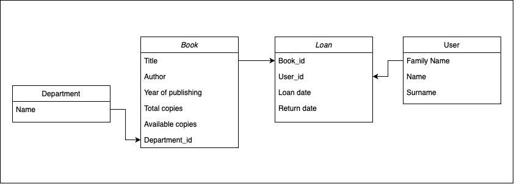

# Library
## Описание
Этот сервис предоставляет API для управления книгами, отделами и посетителями библиотеки. Он позволяет выполнять операции выдачи и возврата книг, управлять списками книг и посетителей, а также добавлять и удалять отделы.

## Использованные технологии

- Django
- Django REST Framework
- Swagger
- PostgreSQL
- Docker

## Перед запуском
Необходимо скопировать .env_example в .env и вставить свои параметры
Чтобы получить secret key необходимо ввести в терминале следующую строку
```console
python -c 'from django.core.management.utils import get_random_secret_key; print(get_random_secret_key())'
```

## Запуск приложения через контейнер
Запустится postgres и django приложение
```console
docker compose up
```

## Запуск приложения без контейнера
```console
pip install -r requirements.txt
python manage.py migrate
python manage.py runserver
```

## Схема базы данных сервиса


### Создать нового посетителя
#### POST `/api/visitor/new`
Описание: Этот эндпоинт позволяет создать нового посетителя библиотеки.

**Parameters**

| Parameter     | Type     | Description                   |
|:--------------| :------- |:------------------------------|
| `family_name` | `string` | **Required**. family name     |
| `name`        | `string` | **Required**. name            |
| `surname`     | `string` | **Not Required**. family name |


## Удалить посетителя
#### DELETE `/api/visitor/<visitor_id>`
Описание: Этот эндпоинт позволяет удалить посетителя библиотеки по его идентификатору.
Параметры запроса: `visitor_id` - идентификатор посетителя


## Получить список посетителей с информацией о количестве взятых книг
#### GET `/api/visitor/list/books-loaned`
Описание: Этот эндпоинт возвращает список всех посетителей библиотеки с информацией о количестве взятых ими книг.


## Создать новый отдел
#### POST `/api/department/new`
Описание: Этот эндпоинт позволяет создать новый отдел библиотеки.

**Parameters**

| Parameter | Type     | Description                      |
|:----------| :------- |:---------------------------------|
| `name`    | `string` | **Required**. name of department |


## Получить отдел библиотеки по его идентификатору
GET `/api/department/<department_id>`
Описание: Этот эндпоинт возвращает информацию об отделе библиотеки по его идентификатору.
Параметры запроса: `department_id` - идентификатор отдела


## Получить список всех отделов библиотеки
#### GET `/api/department/list`
Описание: Этот эндпоинт возвращает список всех отделов библиотеки.


## Оформить выдачу книги посетителю
#### POST `/api/loan/<book_id>/<visitor_id>/`
Описание: Этот эндпоинт позволяет оформить выдачу книги посетителю библиотеки.
Параметры запроса: `book_id` - идентификатор книги, `visitor_id` - идентификатор посетителя


## Оформить возврат книги
#### POST `/api/return/<loan_id>/`
Описание: Этот эндпоинт позволяет оформить возврат книги в библиотеку.
Параметры запроса: `loan_id` - идентификатор операции выдачи книги


## Получить список книг с фильтрацией
#### GET `/api/books/list/`
Описание: Этот эндпоинт позволяет получить список всех книг в библиотеке с возможностью фильтрации.
**Parameters**

| Parameter                    | Type       | Description                |
|:-----------------------------|:-----------|:---------------------------|
| `author`                     | `string`   | Filter by author           |
| `year_of_issue`              | `integer`  | Filter by year             |
| `department`                 | `string`   | Filter by department       |
| `available_copies_gt_zero`   | `boolean`  | Filter by available copies |
